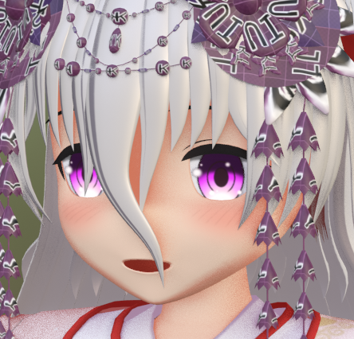
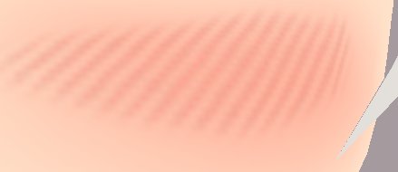
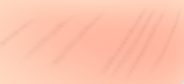
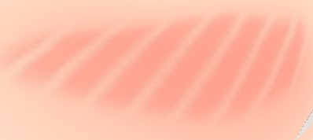

# Substance用ほっぺの斜線マテリアル

## 目的

イラストよりのキャラクタをモデリングしている時、頬っぺたの赤みどうしてますか？

頬っぺたの赤みだけなら塗っちゃえば終わりですが、斜線で表現したいときってありますよね？

 
<small>ほっぺたに斜線をいれるよ</small>

テクスチャに描くと意外と位置やサイズを合わせるのが面倒で、意外と面倒なのを毎度描くのもやっぱり面倒、だったらジェネレーターを作ればいいじゃない？

ということで作ってみました。

## パラメーター

### X Amount
線の密度を設定します。数値を増やすと数が増え細かいラインになります。
 

### Position
折りたたまれていますが中にランダム化のパラメータが入っています。

#### Position Random X Random
線のランダムさを設定します。線と線の間の距離がランダムになります。
 

#### Position Random Y Random
使いません。

### Size X
線の太さを設定します。密度を設定した後いい感じの太さにしてください。
 

### Size Y
使いません。

### Image Inputs
色を設定します。
 

